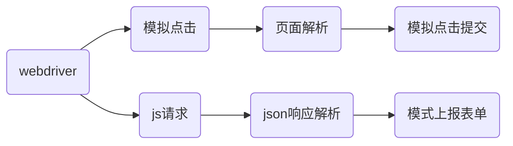
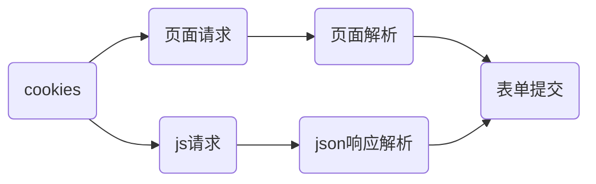

##自动点餐系统
[TOC]

### 数据结构设计

- dinner_base_info
- dinner_history_info
- dinner_rank_info

### 解决方案

#### selenium方案

流程图

```mermaid
graph LR
A(webdriver)-->B(模拟点击)
B-->B1(页面解析)
B1-->F(模拟点击提交)

A-->C(js请求)
C-->C1(json响应解析)
C1-->Z(模式上报表单)
```

#### cookie方案

流程图

```mermaid
graph LR
A(cookies)-->B(页面请求)
B-->B1(页面解析)
B1-->Z(表单提交)
A-->C(js请求)
C-->C1(json响应解析)
C1-->Z(表单提交)
```

 ##参考