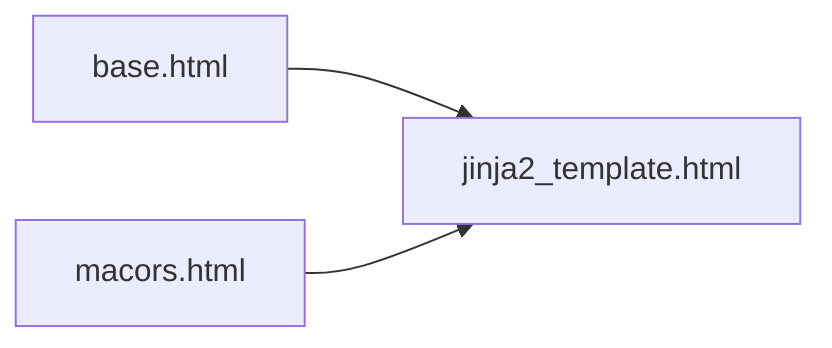
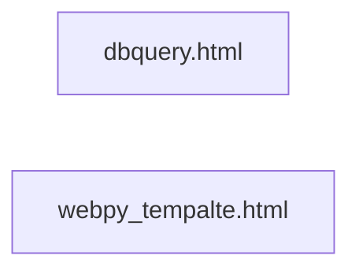

##模板关系
[TOC]

jinja2模板关系:

```mermaid
graph LR
base.html-->jinja2_template.html
macors.html-->jinja2_template.html
```

web.py模板

```mermaid
graph LR
dbquery.html
webpy_tempalte.html
```

> 两个模板之间不存在任何的继承关系，但在web.py的render作用下，可将python的数据封装在html文件里，方便展示

 ##参考